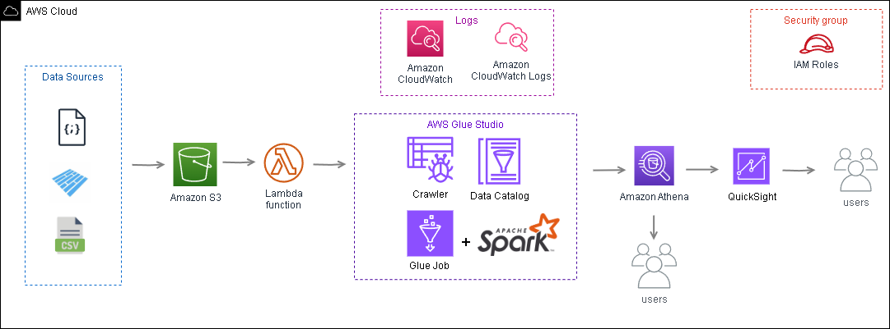
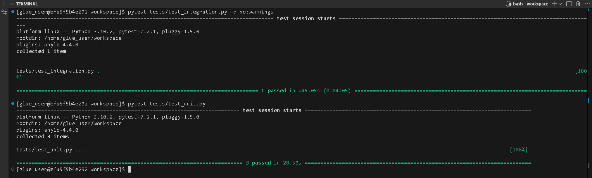

# AWS - Projeto de Engenharia de Dados: ETL da HealthTech utilizando S3, Lambda, AWS Glue e Amazon Athena.

Este repositório contém o código e a documentação para o projeto de ETL (Extract, Transform, Load) dos dados de uma empresa HealthTech. O projeto utiliza as ferramentas da AWS para a execução e gerenciamento dos recursos de dados. Os dados utilizados são ficticios.

### Pré-requisitos

Antes de iniciar, certifique-se de ter instalado em sua máquina local:

* Git
* Docker
* Conta na AWS (Amazon Web Services)
* AWS CLI configurada na máquina 
* VSCode

## Ambiente de Desenvolvimento Encapsulado com Docker

Para garantir consistência e facilidade de configuração, o ambiente de desenvolvimento é encapsulado em um contêiner Docker. Isso permite que você utilize o ambiente localmente com todas as dependências necessárias.

### Dockerfile para Ambiente de Desenvolvimento
Video com o passo a passo para configurar o AWS CLI e o ambiente de desenvolvimento com uma imagem pronta do Docker Hub.

[AWS CLI-Instalando e Configurando (Com Profile)](https://www.youtube.com/watch?v=4irgsIK01rQ)

[AWS Glue localmente usando o Visual Studio Code e o Docker no Windows](https://www.youtube.com/watch?v=__j-SyopVBs&t=26s).


### Executar o ambiente local com Docker
Este projeto utiliza Docker para configurar um ambiente local com Spark para testes.

```
# Use a imagem base do AWS Glue
FROM amazon/aws-glue-libs:glue_libs_4.0.0_image_01

# Instalar as dependências necessárias
RUN apt-get update && apt-get install -y \
    python3-pip

# Instalar pytest na versão especificada
RUN pip3 install pytest==7.2.1

# Definir o diretório de trabalho
WORKDIR /workspace

# Comando para manter o contêiner rodando
CMD ["bash"]
```

## Construir e executar o contêiner Docker

```
docker build -t amazon/aws-glue-libs:glue_libs_4.0.0_image_01.

docker run -it -v "C:\Users\seu_usuario\.aws:/home/glue_user/.aws" -v "C:\Users\seu_usuario\Documents\seu_usuario\caminho\do\respoitorio\WORKSPACE_LOCATION:/home/glue_user/workspace" -e AWS_PROFILE=seu_profile -e DISABLE_SSL=true --rm -p 4040:4040 -p 18080:18080 --name glue_pyspark amazon/aws-glue-libs:glue_libs_4.0.0_image_01
```

### Desenvolvimento com VSCode
Você pode utilizar o VSCode para desenvolver e depurar seu código dentro do contêiner Docker. Para isso, abra o VSCode e utilize a extensão "Remote - Containers" para conectar-se ao contêiner em execução.

1. Instale a extensão "Dev Containers" no VSCode.
Abra o VSCode e vá para View -> Command Palette (ou pressione Ctrl+Shift+P).
2. Digite "Dev Containers: Attach to Running Container..." e selecione o contêiner glue_pyspark.
3. Isso abrirá o projeto dentro do contêiner, permitindo que você edite e depure o código diretamente no VSCode.

## Arquitetura do Projeto
A arquitetura do projeto foi construída para ser escalável e integrar os dados de múltiplas fontes.



### Componentes
1-  **Amazon IAM:** Gerenciamento de acesso e permissões para recursos AWS, garantindo segurança e controle de acesso apropriado.Crie as permissões necessárias para acesso aos serviços que iremos utlizar, depois cria uma chave e segredo e configure com AWS CLI.<br>
2-  **Amazon S3:** Usado para armazenar arquivos de dados brutos e arquivos de dados processados.<br>
3- **AWS Lambda:** Executa funções de forma automática em resposta a eventos, como o carregamento de arquivos no S3. No contexto deste projeto, Lambda é usado para disparar o AWS Glue Job sempre que novos dados são carregados no S3.
4-  **AWS Glue Crawler:** Catalogação dos dados no Glue Data Catalog.<br>
5-  **AWS Glue Job:** Processa e transforma os dados.<br>
6-  **Amazon Athena:** Permite realizar consultas nos dados processados, utilizando SQL diretamente sobre os dados armazenados no S3..<br>
7-  **Amazon QuickSight:** Criação de dashboards interativos e relatórios.<br>
8-  **Amazon CloudWatch:** Monitoramento e logging das métricas e logs dos serviços, incluindo execução de Glue Jobs, desempenho e erros.<br>
9- **Usuários:** Os usuários com acesso podem acessar os dados diretamente via Athena e os usuários finais as visualizações através do QuickSight.

## Estrutura do Projeto 

- `.dev/:` Contém arquivos do ambiente de desenvolvimento e teste.
    - `.src/:` Contém o arquivo `job_pipeline.py`
    - `tests/:` Contém o script de teste local no Jupyter Notebook.
    - `Dockerfile:` Arquivo Docker para configurar o ambiente de desenvolvimento e testes.
- `.prod/:` Contém arquivos do ambiente de produção.
    - `src/:` Contém os scripts do job ETL e da função lambda.
    - `Consultas_athena`: Contém as queries efetuadas no athena.
 - `dicionario_dados.md:` Dicionário dos dados tratados.
 - `README.md:` Este arquivo de documentação.

## Ambiente de Desenvolvimento e Testes
No ambiente de desenvolvimento e testes, o fluxo de ETL é projetado para permitir rápidas iterações e validações contínuas. 

### Validação com Testes:

* **Testes Unitários:** Validam individualmente funções e métodos do código.
* **Testes de Integração:** Garantem que os diferentes componentes do sistema funcionem corretamente juntos, verificando o fluxo completo do pipeline de dados.
Caso todos os testes passem, irá aparecer uma conforme abaixo:



O passo a passo do ambiente de testes. [documentação ambiente de testes](dev/README_dev.md).

## Ambiente de Produção
No ambiente de produção, o foco é a automação e a escalabilidade, garantindo que o processamento de dados ocorra de forma eficiente e segura.

## Passo a Passo de forma simplificada:
- **Upload dos dados** para o bucket S3 cliente_data_raw.
- **Lambda** é acionada automaticamente para iniciar o processamento.
- **Glue Crawler** atualiza o catálogo de dados.
- **Glue Job** processa os dados e salva em Parquet.
- **Athena** e QuickSight são usados para consultas e visualizações.

O passo a passo completo do ambiente de produção. [documentação ambiente de produção](/home/glue_user/workspace/prod/README_prod.md).