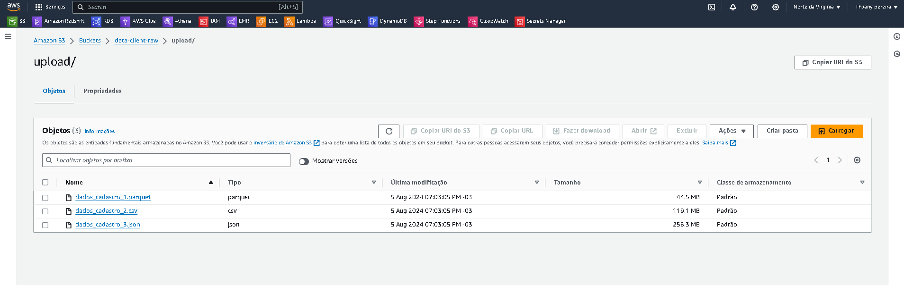
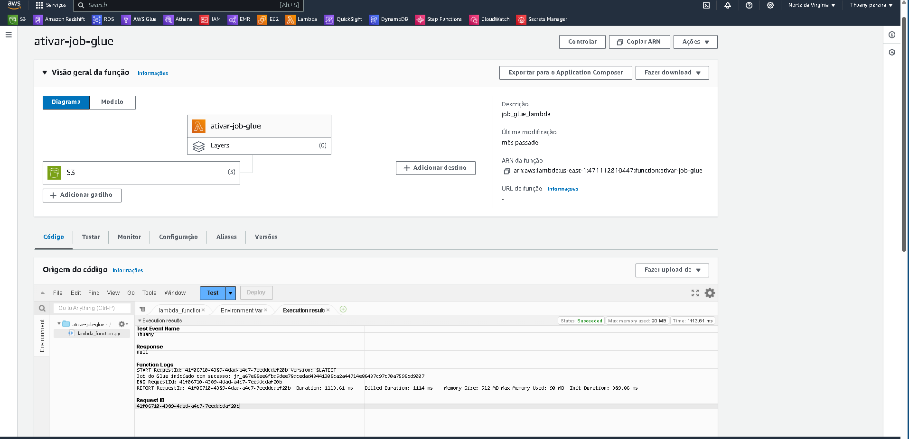
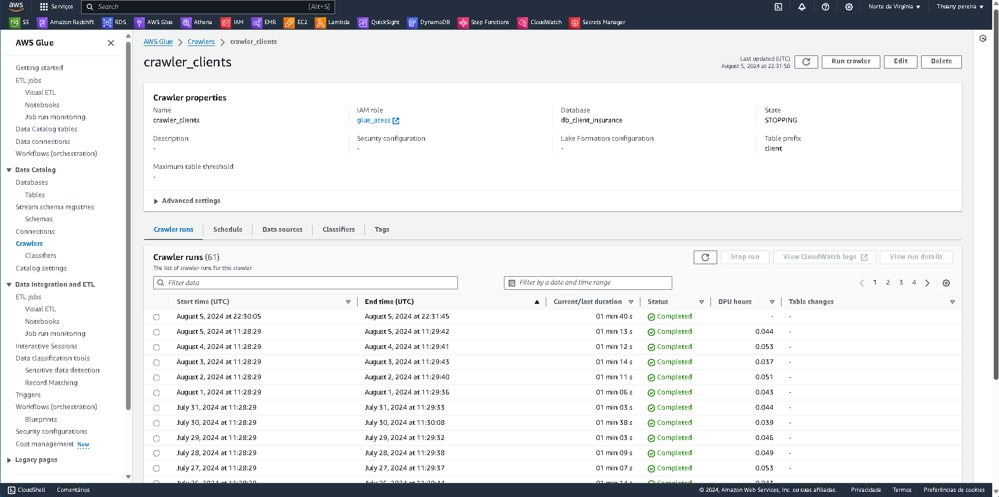
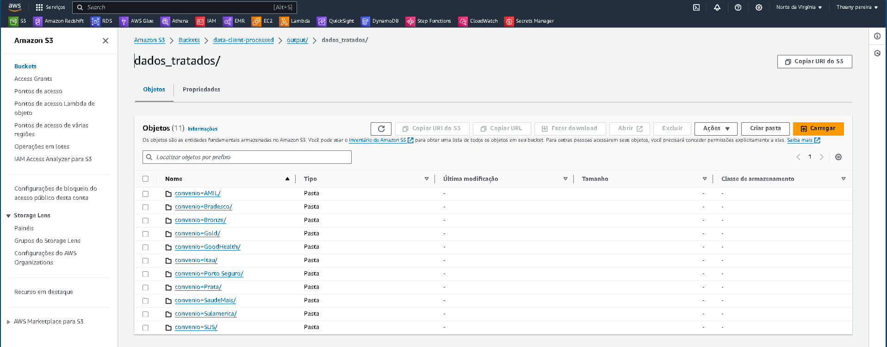
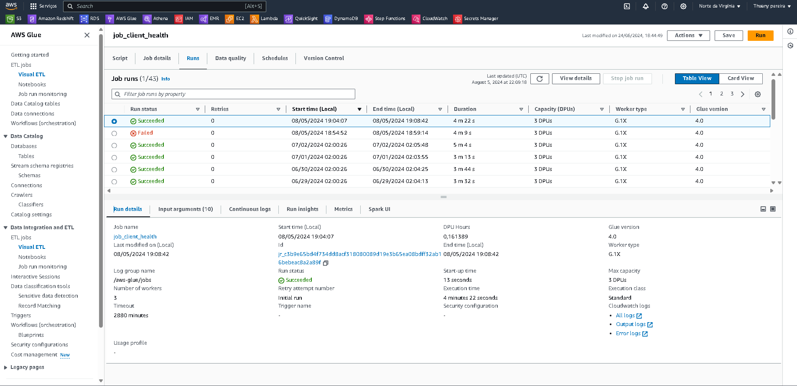
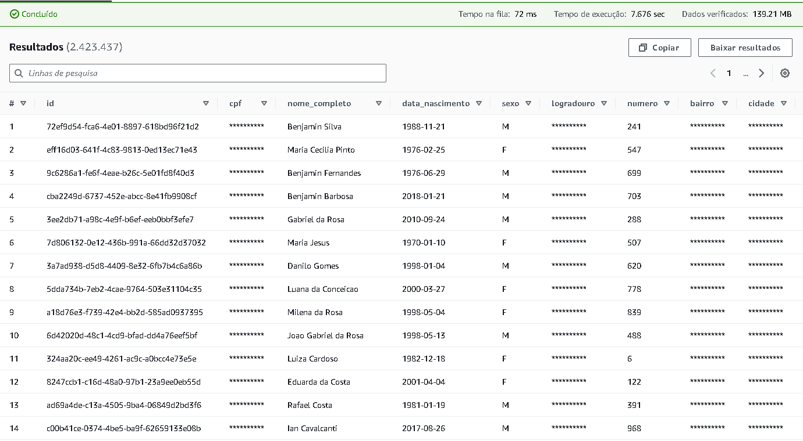
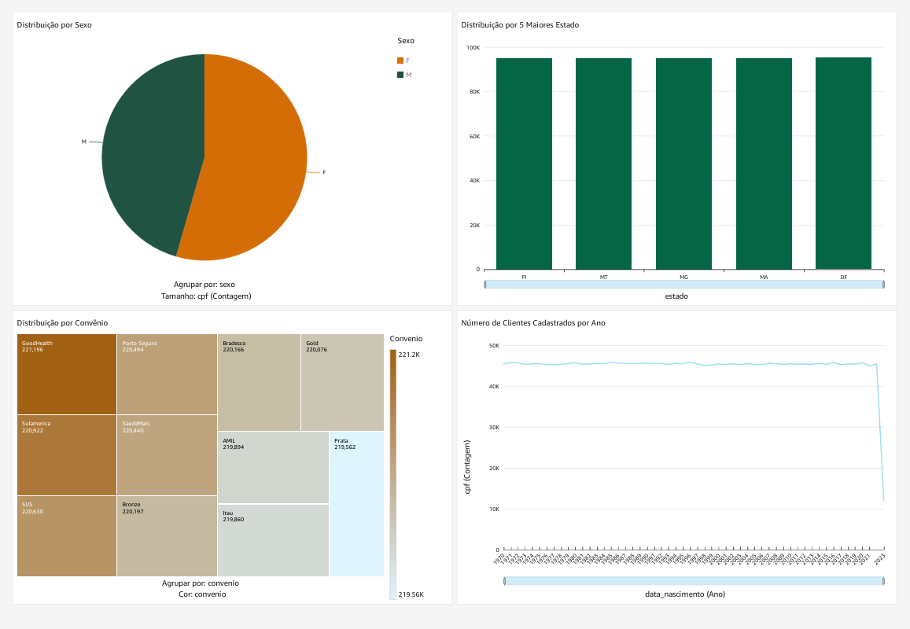

# Ambiente de Produção
Este pipeline de ETL é projetado para transformar e carregar dados de maneira eficiente e segura. Aqui está um passo a passo de como o processo é executado em produção, com destaque para as otimizações e práticas recomendadas.

## Carregamento dos Dados Brutos no S3
Os dados brutos são carregados diariamente no bucket S3 chamado `cliente_data_raw`. É crucial qeu sejam carregados os 3 arquivos  para que o processo de ingestão funcione sem problemas. 

## Acionamento da Lambda
Assim que todos os arquivos são carregados no S3, uma função Lambda `def_lambda.py`é automaticamente disparada. Essa função é responsável por iniciar o Glue Job que fará o processamento dos dados automatizado.

## Execução do Glue Crawler
Depois que a Lambda inicia o Glue Job, o Glue Crawler entra em ação para atualizar o Glue Data Catalog. Isso é importante para garantir que todas as mudanças nos dados sejam refletidas no catálogo, facilitando as consultas posteriores.

## Execução do Glue Job
O Glue Job faz a parte pesada do trabalho:

### Funcionalidades e Transformações

Inicialmente, o pipeline lê dados de três formatos diferentes armazenados no S3. Cada formato (Parquet, CSV, JSON) é tratado por funções específicas (transform_parquet, transform_csv, transform_json) para garantir o processamento adequado. O script com o código da pipeline pode ser encontrado 

[Script pipeline](https://github.com/thuanyvermelho/projeto_aws_etl_glue/blob/master/prod/src/script/job_client_health.py)

**Normalização de Texto:**
A função `remove_accents_udf` é utilizada para remover acentos e normalizar textos, garantindo consistência nos dados textuais.
A conversão de nomes completos de estados para suas respectivas siglas é realizada pela função substituir_estado_por_sigla_udf.

### Tratamento de Dados

**Valores Nulos:** Valores nulos são substituídos por valores padrão, como "N/A" para strings ou "1970-01-01" para datas, para evitar inconsistências.

**Remoção de Duplicatas:** Utiliza-se uma lógica de janela de particionamento para identificar e remover registros duplicados, mantendo o mais recente com base na data de cadastro.
Validação e Qualidade dos Dados:

**Validação de Esquema:** A função validar_esquema assegura que o DataFrame final corresponda ao esquema esperado, verificando tipos de dados e nomes de colunas.

**Verificação de Qualidade:** A função `validar_qualidade_dados` verifica a presença de valores nulos em colunas obrigatórias, formato e unicidade de CPFs, e integridade geral dos dados.

**Proteção de Dados Sensíveis (LGPD):**
Dados sensíveis, como CPF, endereço e cidade, são mascarados utilizando caracteres "*", em conformidade com a LGPD.

**Geração de IDs Únicos:**
Uma coluna "id" com UUIDs é gerada para cada registro, assegurando que cada linha tenha uma chave única.

**Armazenamento Final:** Os dados tratados e transformados são salvos em formato Parquet no S3, particionados por "convenio". O particionamento facilita futuras consultas e a gestão eficiente dos dados.

### Otimizações Implementadas
**Uso de Spark e Glue:**

A utilização de SparkSession e GlueContext permite o processamento distribuído dos dados, aumentando a escalabilidade e a eficiência do pipeline.
**Particionamento dos Dados:** O particionamento dos dados por "convenio" não só organiza os dados, mas também melhora a performance de consultas futuras.

### Boas Práticas

**UDFs para Consistência:**
A utilização de UDFs (User Defined Functions) para operações como remoção de acentos e substituição de siglas garante que as transformações sejam aplicadas de forma consistente em todo o conjunto de dados.

**Validação Estruturada:**
A implementação de validações detalhadas garante que os dados estejam sempre no formato correto e sem erros antes de serem armazenados, minimizando problemas futuros.

**Conformidade com a LGPD:**    
Técnicas de mascaramento de dados são aplicadas para proteger informações sensíveis, em conformidade com regulamentações de privacidade como a LGPD.

## Consultas e Visualizações
Com os dados transformados e salvos, você pode:

**Consultar com Amazon Athena:** Use o Athena para fazer consultas SQL nos dados processados. Isso é útil para análise ad-hoc e para explorar os dados.

**Dashboards no Amazon QuickSight:** Os dados também são usados para criar dashboards interativos e relatórios no QuickSight. Isso facilita a visualização e análise de informações importantes.

